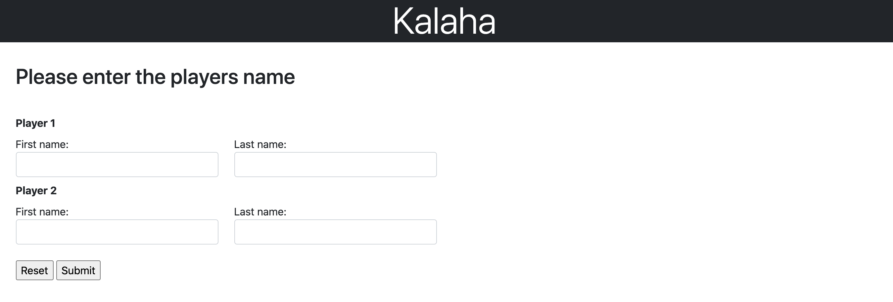
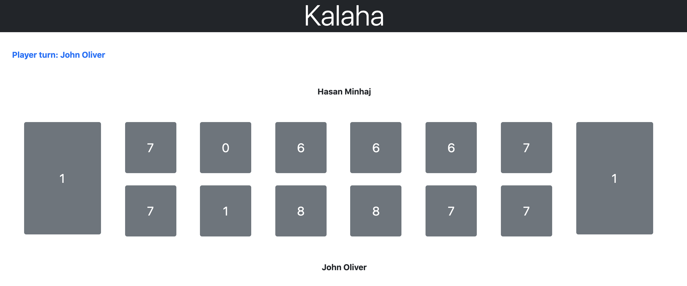

# Kalaha

## Pre-requisite
Docker should be installed  
Run below from root of the project(mohammad-ghalib-nashtar) to start container for postgresql db
```bash
docker-compose up
```

*Note: Above command uses port 5432 for database.  
If you wish to use any other port, please change it in application.properties as well.*

<br>

## Building and running from code
Go to the root folder of the code i.e. mohammad-ghalib-nashtar (in terminal/command prompt) and run (use mvnw.cmd for windows)
```bash
sh ./mvnw clean install
sh ./mvnw spring-boot:run
```

<br>

## Running from jar
Go to the location(project-root/kalaha-api/target) of the jar (in terminal/command prompt) and run
```bash
java -jar kalaha-api-0.0.1-SNAPSHOT.jar
```

<br>

## Play
Go to url to start playing http://localhost:8080/game.  
Few screenshots below.  
Add players  


<br>

Play game  

<br>

## Game rules
For rules of the games please refer https://www.wikihow.com/Play-Kalaha            